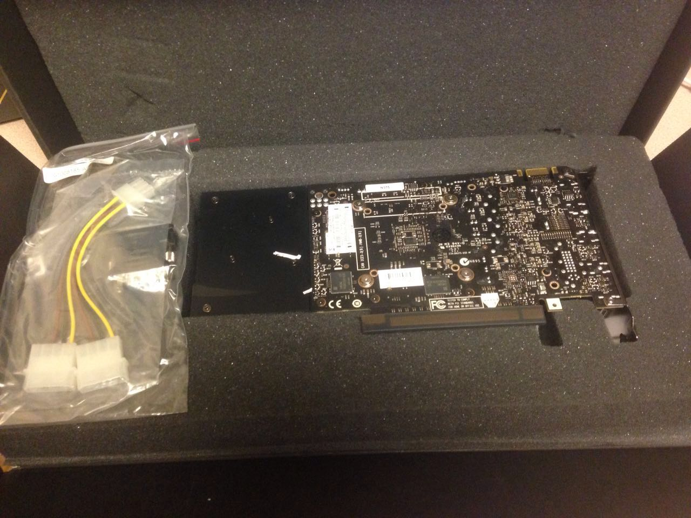
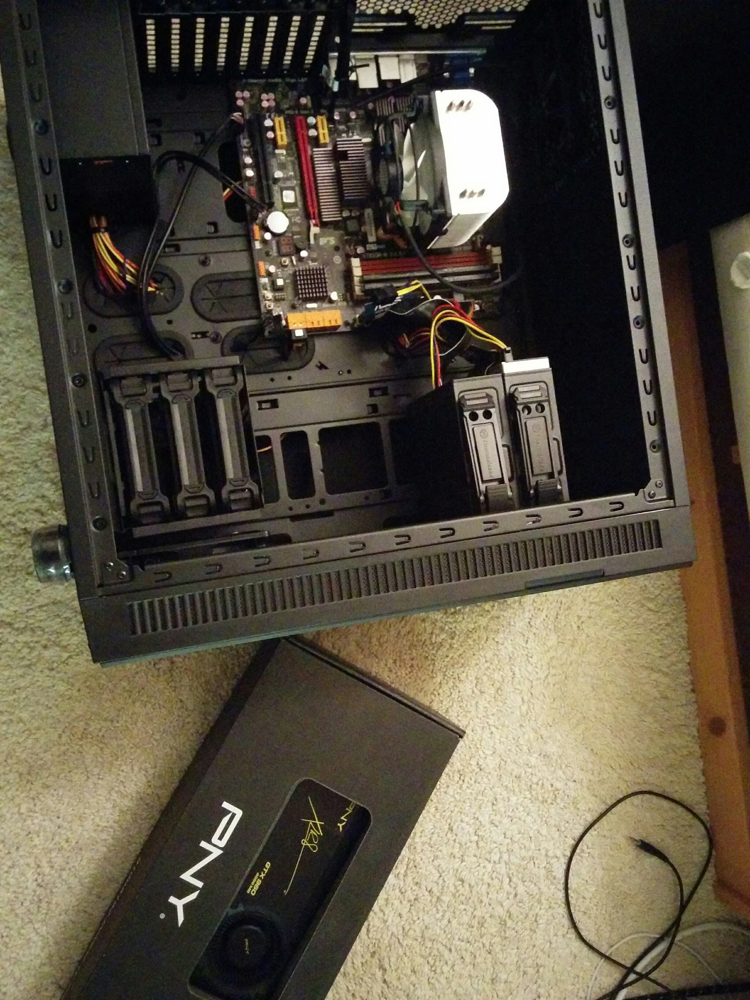
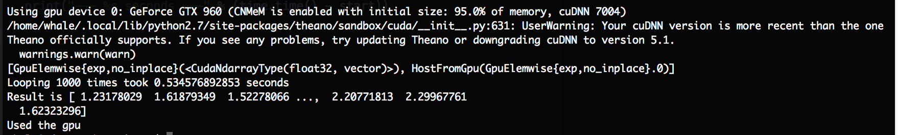
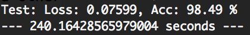
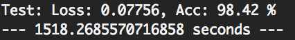
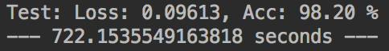

### Need For Speed
Deep learning models can be large and slow to train. There are many ways you can train and run your awesome deep learning model. But you may not want to push your two year old laptop to its limit for training on a dataset over days or weeks. In his [deep learning Coursera courses] (https://www.coursera.org/specializations/deep-learning), Andrew Ng also suggested that shorter iterations of development and model training is important to get good results on machine learning projects, since in a given amount of time, you can experiment more with respect to model architecture, hyper parameters, or more training data if available. What matters is that you do not want to wait for weeks or even months before you can make adjustment to the models.

There are of course many ways to accelerate deep learning training. But nowadays, it often goes down to the choice of hardware than software. Mainstream deep learning or machine learning libraries are implemented in high level languages but well utilized low level numeric libraries and thus their actual performances do not differ as much. Also they are actively maintained and optimized so choosing the language or library do not provide huge improvement.

On the other hand, using suitable or better hardware can make a huge difference in deep learning model training. Finding the right set of parameters during training a model relies on the numeric computation of matrics. The whole process is fulfilled with a large quantity of relatively simple numeric operations. Normally, for low-end hardware (i.e. the ones most of us used at home or work), CPU is designed to solve complex computation tasks in serial processing manner, or one element per operation, which may not fit the model training process well. However, GPU adopted parallel architecture and is well adapted for vector and matrix operations, which is typical for computer graphics tasks, such as producing lighting effects from objects, 3D effects, etc. Thus, GPU is an ideal choice to handle such vector and matrix operations in parallel in model training. So this brought up the concept of GPGPU or [General-purpose computing on graphics processing units](https://en.wikipedia.org/wiki/General-purpose_computing_on_graphics_processing_units). 

Please be noted, this is not to say that you should not at all train a machine learning or even deep model with CPU. In many cases (normally small scaled), it might be faster still but when the data volume grows. But for typical deep learning problems, GPU had been well proved to be significantly faster in performing optimization algorithms such as stochastic gradient descent. 

### Getting GPUs
So now we decided to get GPU for training models. Two options now exists 1. buy a GPU; 2. rent a GPU through cloud computing services. Here I only talks about getting a GPU for your home build computer than renting hours from AWS or Google Cloud. Also at least two major GPU providers NVidia or AMD (ATI) are out there, here I only talk about NVidia GPUs since NVIDIA’s libraries and support are better established (you probably have heard about CUDA). So buying a GPU actually means to buy a video card, which could be manufactured by third party video card vendor.  

There are many analysis about getting GPUs for deep learning projects and one great blog post of these is done by Tim Dettmers. Not only that he painstakingly analyzed with great insight about how/what GPU to get in different needs, but he also managed to keep it updated through time -- and the latest post is [here](http://timdettmers.com/2017/04/09/which-gpu-for-deep-learning/).
In fact, he also provide analysis on why (not) to use AWS provided GPU computation (relatively cost inefficient). But for me, make a build is fun as well.

### Make the Build
In general, build a workstation or desktop for your deep learning projects is very like to build a gaming rig. If you do not have a pile of old build or computer parts around and will build it from scratch, but occasionally, computer vendors may also have gaming build provided, and if it happens to be equipped with the desired GPU, CPU and enough memory, it could be cheaper than a self build. But it is quite likely that you will choose your own parts. There are tons of analysis and tutorial online but be sure to read Tim Dettmers' post first (above). 

In my case, I have some used parts around including a 4-year-old AMD Athlon X4 CPU, an old set of 20 GB memory, and a compatible motherboard. Old CPU sometimes can be a bit problematic for some DL libraries due to missing certain new instruction sets (the ones operate computation in CPU). In my case, I have to eventually compile and install Pytorch from source. It is still working well but it is more trouble to set it up.

For my build, I only purchased three components 1. video card; 2. computer case; 3. power supply. For both computer case and power supply, I consider quietness is important. Computer case should be solid and I like it to be large and expandable for cooling and permitting future build updates. Power supply should have more than 500 Watts, which is powerful enough for one GPU build but more is needed if more GPUs are needed. I also would spend a bit more for quality to support running heavy load over extended time. I got the important piece, video card as a used one from ebay -- equipped a NVidia GTX960 GPU with 4GB video RAM (This field changed so fast that 4GB should be at most entry level by now -- larger model needs more video RAM). Overall, I only spent ~250 dollars on those three components and the budget can be controlled sub 1000 to replace everything new. 



An optical drive or large volume USB drive may help to install a version of Linux (Ubuntu, CentoOS, you name it). 

Anyway, it is an exciting moment when it is assembled to look like this (the video card is on the side not installed yet).



### Setting Up
I only used a monitor to temporarily connect to the build during the setup and then I installed an ssh server there and so I can work from my laptop but only use the build to run the model. There are two good reasons to do so 1.use an monitor will have to take some resources from the video card, which could have been used for the model training; 2. I do not need to setup more things for development on the build itself while my laptop had been all done. One tip here is to follow at least a basic security practice including some firewall settings. One such tutorial can be found [here](https://www.digitalocean.com/community/tutorials/initial-server-setup-with-ubuntu-16-04).

In my setup, to install the right drivers such as the wireless adapter or for the video card itself can be a hassle -- Finding the right version of NVidia driver compatible with the video card, the OS, and the other libraries may use some trial and error time. I at least spent more than 10 frustrating hours on setting up. Internet is your oyster. 

For the required DL stacks, I installed both anaconda python package 2.7 and 3.6. A latest CUDA API package (not the same as the video card driver) and a proper version of CuDNN library for Deep Learning using CUDA should be [installed](http://docs.nvidia.com/deeplearning/sdk/cudnn-install/index.html) before moving on to DL packages. For the DL packages, I started with Theano ([MILA will stop developing Theano](https://groups.google.com/d/msg/theano-users/7Poq8BZutbY/rNCIfvAEAwAJ)), Tensorflow, Keras, and Pytorch. There are a ton of tutorials online about installation of these DL packages. Taken the example of Theano, upon proper installation and configuration, running this [script](
http://deeplearning.net/software/theano/tutorial/using_gpu.html#testing-theano-with-gpu) will show the following output.



I used two ways to transfer files between the desktop server and my laptop -- 1. scp command for single file for convenience, as well for big files (e.g. data) for speed (through a Gigabyte home network) ; 2. Use github to sync the code repositories. 

### So How Faster It Can Be
I will demo this with a Pytorch implementation of LeNet over MNIST dataset. To define the network is super easy as below.

```python
class Lenet(nn.Module):
    def __init__(self):
        super(Lenet, self).__init__()
        self.conv = nn.Sequential(
            nn.Conv2d(1, 6, 3, stride=1, padding=1),
            nn.MaxPool2d(2, 2),
            nn.Conv2d(6, 16, 5, stride=1, padding=0),
            nn.MaxPool2d(2, 2)
        )

        self.fc = nn.Sequential(
            nn.Linear(400, 120),
            nn.Linear(120, 84),
            nn.Linear(84, 10)
        )


    def forward(self, x):
        out = self.conv(x)
        out = out.view(out.size(0), -1)
        out = self.fc(out)
        return out
```

Then throw in a training method to include both forward and backward passing:

```python
def train(criterion = nn.CrossEntropyLoss(size_average=False),
                use_gpu = False):
    lenet = Lenet()
    if use_gpu:
        lenet.cuda()
    optimizer = optim.SGD(lenet.parameters(), lr=learning_rate)
    
    for i in range(epoches):
        running_loss = 0.
        running_acc = 0.
        for (img, label) in trainloader:
            if use_gpu:
                img = Variable(img).cuda()
                label = Variable(label).cuda()
            else:
                img = Variable(img)
                label = Variable(label)
			
			# forward
            optimizer.zero_grad()
            output = lenet(img)
            loss = criterion(output, label)
            
            # backward
            loss.backward()
            optimizer.step()

			# compute the loss
            running_loss += loss.data[0]
            _, predict = torch.max(output, 1)
            correct_num = (predict == label).sum()
            running_acc += correct_num.data[0]

        running_loss /= len(trainset)
        running_acc /= len(trainset)

        print("[%d/%d] Loss: %.5f, Acc: %.2f" % (
        i + 1, epoches, running_loss, 100 * running_acc))
    return lenet
```

Then the predict function can be similarly defined as above but only keep the forward pass with the loss calculation. I would omit it here.

Finally, to prepare and load the [MNIST](http://yann.lecun.com/exdb/mnist/) data and other hyperparameter definition including batch size and learning rate.

```python
trans_img = transforms.Compose([
        transforms.ToTensor()
    ])

trainset = MNIST('./data', train=True, transform=trans_img)
testset = MNIST('./data', train=False, transform=trans_img)

trainloader = DataLoader(trainset, batch_size=batch_size, shuffle=True, num_workers=4)
testloader = DataLoader(testset, batch_size=batch_size, shuffle=False, num_workers=4)
```

```python
learning_rate = 1e-3
batch_size = 100
epoches = 50
```

One nice trick for switching between CPU and GPU on different machines is to use a flag variable, without changing the code. In Pytorch, the gpu flag can be determined by querying it as below. 

```
gpu = torch.cuda.is_available()
# ...
nn = train(use_gpu=gpu)
predict(nn, use_gpu=gpu)
```

So finally, with literally no difference in model accuracy, the LeNet model running performance on the GPU or the CPU of my build showed it is more than 6 times faster to use a GPU,  



than a CPU to train a DL model:
   


Of course, it is not quite fair to compare a 4-year-old AMD Athlon processor to a much newer GPU hardware. But even with a much faster 2-year-old 2.2G i7 processor on my laptop, the GTX960 is still clearly the winner by ~3 times.



So happy coding, ... and thanks, gamers!

