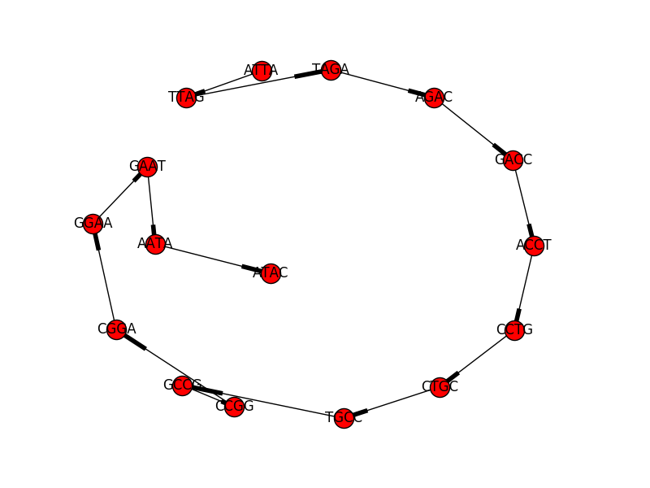

### tl;dr
DNA De Novo Assembly is a problem that can be resolved by finding a Euler path in a [de Bruijn graph](https://en.wikipedia.org/wiki/De_Bruijn_graph) with each edge representing a set of short sequences of DNA. An implementation of de Bruijn Graph based DNA De Novo Assembly method is as [here](https://github.com/guojingyu/DeNovoAssembly). 

### Background
In the most obvious way, a piece of DNA in computer can be represented as a sequence of ordered chars that are comprised of 4 different chars “A”, “T”, “C”, and “G” representing four different types of nucleotides (the base group of each type are adenine, thymine, cytosine, and guanine). The sequence can be as long as many millions of chars (nucleotides) for a typical human chromosome, or in many other species. The genetic information that are carried by genes and other functional/structural sequences as sections on this string in a largely sequential way. 

One of the breakthroughs over the past years in biology research is DNA sequencing technology, which is mean to find out the nucleotide (char) information within very long pieces of DNA sequences (chromosome or part of it). However, current DNA sequencing technology can only provide quite short reads in a length of few hundred nucleotides, which is far shorter than the multiple millions long chromosomes. You may think this as taking a copy of a few continuous words in a book. Therefore, to understand the order of all the chars in a given chromosome, people tried to get many many reads (with potential overlaps) from different locations of the chromosome and then taking these reads to assemble the whole sequence of the chromosome.

Of course, in some species, such as human, similar effort had been done to provide a reference genome, which are comprised of chromosomes or essentially assemblies of many reads. The reference genome is like a map to guide to pinpoint a DNA sequencing read to where it might be. So nowadays, to sequencing a human genome is mainly to discover variations of the genome by different people, since a particular read from a given person, even with some nucleotide variation, can be aligned to the human reference genome. This is a different problem (resequencing) than what this post is about (De Novo Assembly). On the contrary, this post is about a method to make those assemblies from many reads, given no reference genome to look up.

One interesting analog to the DNA De Novo Assembly problem used newspaper. Imagine to set a bomb on a pile of same newspapers. The explosure will tear each copy of newspaper into different pieces. The goal is to figure out the headline news or recover all articles in the newspaper. The clue would be that some pieces from different copies may be overlapped a bit and thus we can assemble them into a slightly larger piece like a jigsaw puzzle.

### Overview of the Solution

I may assume some understanding to basic Graph knowledge. The following figure provided an overview of the solution. This project is implemented with referring to [k-mer](https://en.wikipedia.org/wiki/K-mer) built de Bruijn Graph and Euler Walk method, which is to find a path/circuit including all edges once and only once in the graph. 


This process can be seen as a break down of a few elements: 1. DNA sequence library as a set of relatively short strings comprised of “A”, “T”, “C”, and “G”. Ideally, they could be fragments from many copies of the same chromosome or other DNA sequences (thinking sentences from the newspapers); 2. For each of such strings, assuming length n, pick a positive integer k, and make a set of k-mers starting from each char from 0 to n-k-1 (0-indexed). In the figure above, the given example has k=5; 3. Then take each of these k-mers as edges, and for such a k-mer edge, use k-1 prefix and k-1 suffix as the starting and ending nodes -- the de Bruijn graph is build with these nodes and edges; 4. Then, apply the Euler Walk method to identify a path that traverses all edges once and only once (including all parallel edges); 5. All k-mers on the neighbor edges in the path will extend the assembled sequence. 

At this point it may feel a bit weird that to assembly something together, we have to break the fragments into smaller pieces ... but somehow it works, and generally well. Intuitively, the k-mers made from each library sequence may form a 'local' subgraph. By doing so, there are more 'finer local' sequence information that are overlapped with k-mers from other library sequences, while the order to assemble the 'local' subgraph into a sequence was still kept. 

The de Bruijn Graph based sequence assembly method avoided (to some extent) over collapsed repeats problem that might be introduced by the overlapping based methods (overlap-layout-consensus)[2]. As well it is used more widely in NGS based assembly applications, thus it was chosen for this project.

### de Bruijn Graph

From above, we can see that a de Bruijn graph is built from a collection of strings input as DNA sequences and a k-mer length k as a positive integer, which is typically picked from 3 and above. A set of k-mers are generated and then taken as edges for the de Bruijn graph. For each edge, the two nodes of de Bruijn graph are (k-1)-mers derived from the edge, as a (left) k-1-mer prefix to a (right) k-1-mer suffix of the edge.

As shown in above figure, a de Bruijn graph is a directed graph -- this is actually essential for processing DNA assembly, since DNA sequence is ordered, meaning with a start and an end. 

Also the de Bruijn graph is build in such a manner that merging the same k-1 mer nodes from all edges but permitting multiple edges in connecting such node. Thus a de Bruijn graph is a multigraph. In contrast to a simple graph, multigraph is a graph permitting multiple or parallel edges connecting the same node -- this is to say the node . This is rather important point since commonly the k-mer is quite short and it is expected that the same k-mer can be generated from different part of the much longer DNA sequence. So to allow the edge to be parallel in the graph, is to permit the same k-mer repeating itself else in the assembly (which is actually quite common in DNA sequences) without increasing the number of nodes but only edges. As later analysis will show this is helpful to computational complexity. 

I implemented a python class for the graph and build the graph in the constructor. After some sanity checks, the constructor called the build_DBG method (included after) to make the graph. Then upon the construction is done, the constructor checks for isolated subgraphs of de Bruijn graph. This is because that in real data, there might exists gaps in the DNA library sequences, which means they cannot be assembled into one single piece of DNA.

In fact, the Euler Walk algorithm runs on isolated subgraphs than the whole graph.

```python
import networkx as nx

# ...

class DeBruijnGraph():
    def __init__(self, sequence_dict, k = 3, *args, **kwargs):
    	"""
    	A de Bruijn Graph is a multigraph built from a collection of strings
    	feed from input and k-mer length k. Nodes of DBG are
    	(k-1)-mers and edges join a left k-1-mer to a right k-1-mer is the
    	k-mer itself. 
        :param sequence_dict: sequence dict of Biopython Seq objects
        :param k: k for k-mer length
        """
        self.sequences = [seq_obj.seq for seq_obj in sequence_dict.values()]
        min_len = len(min(self.sequences, key=len))
        if k <= 2: # if k is smaller than 2 the assembly does not work
            logger.error(clock_now() +
                        " DBG : k is too small : " + str(k))
            raise ValueError("DBG : k is too small : " + str(k))
        # or if k is larger than the min length of given sequences
        elif k >= min_len:
            logger.error(clock_now() + " DBG : k is larger than the min "
                                       "length of provide "
                        "sequence : " + str(k))
            raise ValueError("DBG : k is larger than the min length of "
                             "provide "
                        "sequence : " + str(k))
        else:
            self.k = k

        self.G = nx.MultiDiGraph()

        # construct the graph
        self.build_DBG()
        logger.info(clock_now() + " DBG : De Bruijn Graph is made from input "
                                  "sequences ...")

        # check for subgraphs
        self.subgraphs = DeBruijnGraph.extract_directed_subgraphs(self.G)

        logger.info(clock_now() + " DBG : ... including " + str(len(
            self.subgraphs)) + " strongly connected subgraphs.")

        # check subgraph eulerian features
        self.check_eulerian_features_subgraphs()
        logger.info(clock_now() + " DBG : checked subgraphs for their "
                                  "Eulerian features.")
```


The build_DBG is the key method to create the de Bruijn graph. The steps can be described as:
        
1. if a l node (k-1 prefix of k-mer) is in G, don't add it but get the node instead for later;
2. if not, create the node, but also get the node for later;
3. repeat above for the r node (k-1 suffix of k-mer)
4. Add an edge with both l and r node

Please notice that two attributes start and end, are appended to each node added to the graph -- these are to track the beginning and end of any Euler path if exists. 

        
```python
def build_DBG(self):
    """
    This is the essential method to build the DBG.
    The build is assuming an exact matching rule -- referring to "perfect
    sequence". For real NGS project, such assumption does not hold due
    to reasons like sequencing errors, or polyploidy and the matching
    criteria has to be loosened/updated accordingly.
    :param k-mer: a k-mer typed as k-mer class -- One k-mer: one edge and two nodes
    :return:
    """
    for seq in self.sequences:
        for k-mer in self.convert_read_to_k-mer(seq):
            if k-mer.l_node not in self.G.nodes():
                self.G.add_node(k-mer.l_node)
            if k-mer.r_node not in self.G.nodes():
                self.G.add_node(k-mer.r_node)
    if len(self.G.nodes()) > 0:
        [self.G.add_edge(L, R) for L in self.G.nodes_iter() for R in \
                self.G.nodes_iter() if L[1:] == R[:-1]]
    else:
        logger.error(clock_now() + " DBG : Error in DBG build -- zero "
                                   "nodes in graph.")
        raise ValueError("DBG : Error in DBG build -- zero nodes in graph.")
```

### Euler Walk

*... Euler walks through the graph and try to pass through every edge, and when he is stuck, restart on an explored node with unexplored edges and follow the unexplored edges (repeat the explored edges first if needed) ... until there is no more unexplored edges.*

For a graph, Eulerian feature is true if and only if the in degree and out degree of each nodes in the graph is equal. When such criteria is satisified, there exists (at least) one circuit in the graph that pass through each and every edge only once. This provides us a manner to build a circular sequence from the edges (or the nodes) in the order of traverse. However, it is quite common that in a de Bruijn graph, one node could have one extra out degree and another could have one extra in degree, while the rest nodes remains equal of in and out degree. These two unbalanced nodes may represents a start and an end for a Eulerian path, which would be, in this exercise, a linear DNA sequence.

The concept of [Euler path or circuit](http://discretetext.oscarlevin.com/dmoi/sec_paths.html) describes a path to traverse all edges once and only once in a graph. Comparing with computationally intractable [Hamiltonian path](https://en.wikipedia.org/wiki/Hamiltonian_path), the algorithm to find Euler path or circuit with given nodes in a graph is computationally efficient. 

The Euler Walk algorithm, can be described as a restarted random walking. The general steps can be described as below:
1. detect for each subgraph as described above if it is Eulerian and if yes, if it contains Euler circuit or Euler path or both;
2. Find out the Euler circuit if exists;
3. Find out one Euler path if exists;
4. Return none if not Eulerian.

```python
def has_euler_circuit(graph):
    """
     Check if the graph contains odd number of degree nodes to has euler
     path
     :param graph: networkx graph obj
     :return: true or false
     """
    if not nx.is_strongly_connected(graph):
        return False
    for node in graph.nodes_iter():
        if graph.in_degree(node) != graph.out_degree(node):
            return False
    return True

def has_euler_path(graph):
    """
    Check if the graph contains odd number of degree nodes to has euler
    path. If true, also return start and end node; Otherwise, return false
    and none for start and end node
    :param graph: networkx graph obj
    :return: true or false, and start node and end node (depending on if
    true or false)
    """
    flag = False
    start = None
    end = None
    for n in graph.nodes_iter():
        graph.node[n]['end'] = False
        graph.node[n]['start'] = False
        if graph.degree(n) % 2 != 0:
            if graph.out_degree(n) == graph.in_degree(n) - 1:
                graph.node[n]['end'] = True
                end = n
            elif graph.in_degree(n) == graph.out_degree(n) - 1:
                graph.node[n]['start'] = True
                start = n
            flag = True
    return flag, start, end
```

If the option 2 or 3 is performed, the process would be as below:
1. There exists Euler circuit in the subgraph, if there is no odd degree node. In this case, start with any node;
2. There exists Euler path in the subgraph, if there are 2 odd vertices. In this case, start with the node containing one extra out degree;
3. Explore edges one at a time. If facing a choice between a bridge and a non-bridge, always choose the non-bridge.
4. Stop when no unexplored edge in the graph (subgraph). This is done utilizing a stack to track the exploration 'frontier' (similar to Breath First Search) of nodes from the given start node until it is empty.

This method has an O(V + E) complexity -- assuming by average each node has $m$ in degrees and m out degrees, thus the algorithm will access m times of each node (m|V|) to traverse all edges E.


```python
def find_eulerian_path(graph, start):
    """
    a method to find the Eulerian path with a starting node
    """
    if not graph.graph['euler_path']:
        raise RuntimeError("Eulerian : call Eulerian path method on "
                           "graph/subgraph having no Eulerian path: " +
                           graph.nodes())

    copy_graph = graph.__class__(graph)  # copy graph structure
    degree = copy_graph.in_degree
    edges = copy_graph.in_edges_iter
    get_node = operator.itemgetter(0)

    stack = [start]
    last_node = None
    while stack:
        current_node = stack[-1]
        # if there is no more edge to explore
        if degree(current_node) == 0:
            if last_node is not None:
                yield (last_node, current_node)
            last_node = current_node
            stack.pop()  # remove [-1]
        else:  # move on and remove the edge through
            random_edge = next(edges(current_node))
            stack.append(get_node(random_edge))
            copy_graph.remove_edge(*random_edge)
```


### Some Assumptions and Requirements

The implementation utilized a python package 'networkx'. Other required packages can be found [here](https://github.com/guojingyu/DeNovoAssembly/blob/master/requirements.txt).

Also there are some assumptions made to simplify the situation:
1. The sequences are DNA (ATCG bases) "perfect" sequences;
2. No ambiguous base reads.
3. Sequences to be assembled should be longer than repeats if any.
4. The k of k-mer should not be longer than the minimum length of given sequences but larger than 2.


### Results
For the [dummy_data.fasta](https://github.com/guojingyu/DeNovoAssembly/blob/master/data/dummy_data.fasta) file, [a 19 bp long DNA assembly](https://github.com/guojingyu/DeNovoAssembly/blob/master/output/dummy_data_assembly_output.txt) can be found with a k > 5, as *ATTAGACCTGCCGGAATAC*.



For the provided [50 fasta sample file](https://github.com/guojingyu/DeNovoAssembly/blob/master/data/coding_challenge_data_set.fasta), when k is set to 12-15, the output assembled DNA sequence has closely ranged around 20000 bp long but not unique. When the k is set to larger than 20, it would be stablized to a sequence of 19914 bp long.

It is also noticeable, for the provided 50 fasta sample file, that the running time increased when k is getting larger. This holds true at least when k is still relatively small (20-30) than the ~1000 length of the fasta records. It may take ~2 minute to finish if k=20, and similarly or slightly longer to finish at 30, as running as a single threaded on a normal laptop with a 2-year-old i7 processor.

As you can see, it is expected that the right parameter k for a particular task can take some experiment to find out although some empirical knowledge may help. Due to above mentioned potential gaps in the input DNA sequences, for a single run of the algorithm, picking a larger k will generally help to acquire higher quality sequences. However, too large of a k may lead to unnecessary isolated subgraphs. 

Another thing that is worthy mentioning is that tandom repeating sequences without any library sequences containing both non-repeating 'anchoring' flankings, can be a problem for this approach in assembling DNA. The problem is that it is hard to determine how many  copies of the repeats are there.

### References
1. Phillip E C Compeau, Pavel A Pevzner, Glenn Tesler. How to apply de Bruijn graphs to genome assembly. Nature Biotechnology 29, 987–991 (2011) doi:10.1038/nbt.2023
2. Zhenyu Li, Yanxiang Chen, Desheng Mu, Jianying Yuan, Yujian Shi, Hao Zhang, Jun Gan, Nan Li, Xuesong Hu, Binghang Liu, Bicheng Yang, and Wei Fan. Comparison of the two major classes of assembly algorithms: overlap–layout–consensus and de-bruijn-graph. Briefings in Functional Genomics. 2011 doi:10.1093/bfgp/elr035
3. https://www.coursera.org/learn/genome-sequencing/home/ (UCSD coursera Bioinformatics course)
4. I also found this site for a great more detailed explanation about [de Bruijn based method](http://www.homolog.us/Tutorials/index.php?p=1.1&s=1) during drafting this post.

